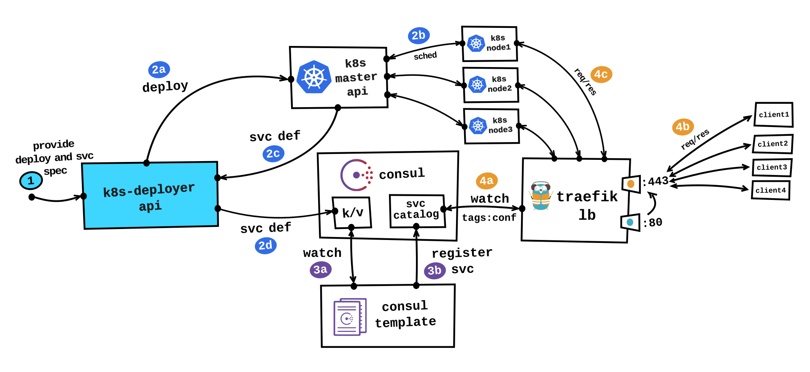

k8s-deployer HTTP API
===


About
---
Deploy Kubernetes service and insert retrieved information into Consul K/V store




Installation
---
#### Supervisor
Install pew (python environment wrapper)
```bash
pip2 install pew
```

Create required project dirs
```bash
mkdir -p /data/pew/virtualenvs
mkdir -p /etc/k8s-deployer
mkdir -p /var/log/k8s-deployer
```

Clone repo
```bash
git clone https://<fqdn>/<username>/k8s-deployer.git /data/pew/k8s-deployer
cd /data/pew/k8s-deployer
```

Create a new virtualenv for `k8s-deployer` project
```bash
WORKON_HOME="/data/pew/virtualenvs" pew new -a /data/pew/k8s-deployer -r requirements.txt k8s-deployer
```

Enter virtualenv (previous commad will also enter virtualenv at the end)
```bash
WORKON_HOME=/data/pew/virtualenvs pew workon k8s-deployer
```

Copy and modify `k8s-deployer` configuration file
```bash
cp /data/pew/k8s-deployer/config.json /etc/k8s-deployer/config.json
```

Copy and modify supervisor configuration file
```bash
cp /data/pew/k8s-deployer/supervisor/k8s-deployer.conf /etc/supervisor/conf.d/k8s-deployer.conf
```

Add and start service
```
supervisorctl reread
supervisorctl add k8s-deployer
```

#### Docker
Supported environment variables

**Note:** Environment variables have precedence over configuration file

| Env Keys                         | Env (default) Values | Value Examples                               | Description                                              |
|:---------------------------------|:---------------------|:---------------------------------------------|:---------------------------------------------------------|
| K8S_DEPLOYER_KUBE_SCHEME         | http                 |                                              | Scheme http or https                                     |
| K8S_DEPLOYER_KUBE_HOST           | localhost            |                                              | Kubernetes API hostname or IP address                    |
| K8S_DEPLOYER_KUBE_PORT           | 8080                 |                                              | Kubernetes API port                                      |
| K8S_DEPLOYER_KUBE_API_HEADERS    | none                 | key1\_\_value1,key2\_\_value2,keyN\_\_valueN | HTTP request headers                                     |
| K8S_DEPLOYER_CONSUL_SCHEME       | http                 |                                              | Scheme http or https                                     |
| K8S_DEPLOYER_CONSUL_HOST         | localhost            |                                              | Consul API hostname or IP address                        |
| K8S_DEPLOYER_CONSUL_PORT         | 8500                 |                                              | Consul API port                                          |
| K8S_DEPLOYER_CONSUL_KEY_PATH     | kubernetes           | kubernetes/prod                              | Consul K/V store path where all the data will be stored  |
| K8S_DEPLOYER_CONSUL_SPECS_RETENT | 5                    |                                              | How many specifications have to be preserved at any time |

Build and run
```
docker build --no-cache -t k8s-deployer .
docker run -it -d --name k8s-deployer -p 8089:8089 k8s-deployer
```


Usage
---
For quick test deploy you can use `deploy.sh` script located in examples dir, in this dir you will also find `echoserver.json` specification descriptor that will be used for `echoserver` service deployment

```bash
cd examples
./deploy.sh
```

Specification descriptor:
```json
{
    "id": null,
    "namespace": null,
    "objects": {
        "deployments": {
            "specification": {
                "### Kubernetes deployment object spec goes here"
            }
        },
        "services": {
            "specification": {
                "### Kubernetes service object spec goes here"
            }
        }
    }
}
```

If you already have `yaml` spec files you can use `kubectl` to convert these locally to `json` format

**Note:** Only services of [type NodePort](https://kubernetes.io/docs/concepts/services-networking/service/#type-nodeport) will be registered in the Consul service catalog
```bash
kubectl convert -f echoserver-deployment.yaml --local -o json > echoserver-deployment.json
kubectl convert -f echoserver-service.yaml --local -o json > echoserver-service.json
```

After successful `yaml => json` conversion you can use `k8s-specgen.py` script to easily generate `k8s-deployer` specification file
```bash
k8s-specgen.py -d echoserver-deployment.json -s echoserver-service.json -o echoserver.json
```

Kubernetes documentation regarding deployment and service objects

https://kubernetes.io/docs/concepts/workloads/controllers/deployment/

https://kubernetes.io/docs/concepts/services-networking/service/

Kubernetes API references

https://kubernetes.io/docs/reference/

---

Examples
---

In the following example we're going to explain how we can deploy `echoserver` service in `default` namespace

#### Insert specification for new service into the Consul K/V store

**Note:** by default max 5 specifications for the same service will be preserved on the Consul K/V store at any time, you can modify this value in the configuration file or through environment variable `$K8S_DEPLOYER_CONSUL_SPECS_RETENT`

**Note:** after successful transaction, specification ID will be returned as value of `Location` header
```bash
curl -X POST -isSL -H 'Content-Type: application/json' --data '@echoserver.json' http://localhost:8089/specifications/default/echoserver
```

#### List all available specification IDs
```bash
curl -isSL http://localhost:8089/specifications/default/echoserver
```

#### Show service specification
```bash
curl -isSL http://localhost:8089/specifications/default/echoserver/latest
```

#### Deploy a new service using specification previously inserted into the Consul K/V store

**Note:** if we omit specification ID, `latest` specification will be used

**Note:** after every successful build `deployed` spec will be created on this Consul K/V path `$K8S_DEPLOYER_CONSUL_KEY_PATH/specifications/<namespace>/<service_name>`
```bash
curl -X PUT -isSL http://localhost:8089/deployments/default/echoserver
```
or you can explicitly set specification ID
```bash 
curl -X PUT -isSL http://localhost:8089/deployments/default/echoserver/1490691025506482_1650b288-e79c-4247-9b3b-95f1051302c4
```

#### Undeploy existing service

**Note:** it's going to delete all the service related objects from Kubernetes and service definition from the Consul K/V store
```bash
curl -X DELETE -isSL http://localhost:8089/deployments/default/echoserver
```

Update existing service definitions that have been manually modified on the Kubernetes side or
populate Consul K/V store with new service definitions for services that are not deployed through `k8s-deployer` (register service on Consul)

**Note:** Deletion of services that are not fully deployed through `k8s-deployer` API will not be possible via API itself

```bash
curl -X PUT -isSL http://localhost:8089/registration/default/echoserver
```

---
Next go to [consul-template](./consul-template/README.md)
